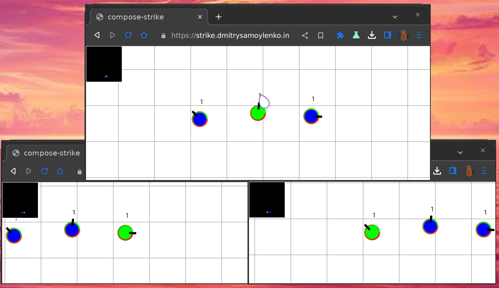

# Compose-Strike

https://strike.dmitrysamoylenko.in

## About

|  |  | -web) | -web) | -windows) | -linux) | -linux) |
| --- | --- | --- | --- | --- | --- | --- |
| yes | yes | yes | yes | yes | yes | yes |
---

Multiplayer game where players can fight against each other.
Powered by Compose Multiplatform and Ktor.

## License

This project is licensed under the [LICENSE](LICENSE).

## Contributing

We welcome contributions from the community! Please feel free to submit issues, feature requests, or pull requests to help us improve.
